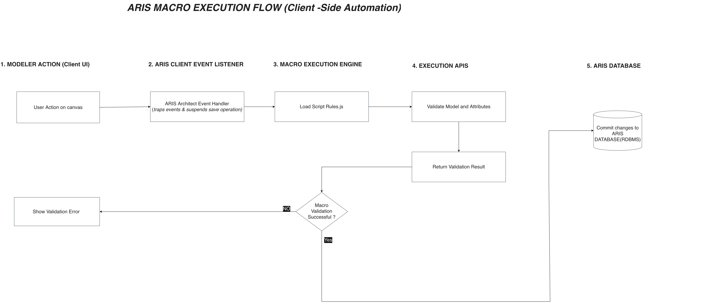

# ARIS Macro Execution Flow (Client-Side Automation)

An architectural breakdown of event-driven, client-side script validation within enterprise BPM modeling environments like ARIS Architect.

This repository details the 5-layer interaction model that enforces real-time process governance, traps canvas events, evaluates custom business rules via execution APIs, and manages database transaction commits.

---

## 🖼️ Architectural Diagram



---

## 📌 Architecture Overview

```text
[ 1. Modeler Action (UI) ] 
       │
       ▼
[ 2. ARIS Client Event Listener ] ──(Traps Event & Suspends Save)
       │
       ▼
[ 3. Macro Execution Engine ] ─────(Loads JavaScript Rules)
       │
       ▼
[ 4. Execution APIs ] ─────────────(Evaluates Model & Attributes)
       │
       ▼
[ 5. Decision & Persistence ] ─────► [ YES ] ──► Commit to ARIS RDBMS
       │
       └──────────────────────────► [ NO  ] ──► Display Validation Error
---

## 🎯 Value & Deliverables

### Why This Matters for Process Owners
* **Consistent Quality Control:** Rules are enforced automatically on the canvas, keeping model data clean before it reaches reporting or process mining tools.
* **Less Manual Auditing:** Automated checks catch compliance errors upfront, saving team leads hours of manual review time.
* **Reliable Governance:** Ensures all published workflows meet enterprise standards without relying on people to remember every rule.

### How It Helps Modelers & Teammates
* **Immediate Feedback:** Catches errors the moment you try to save, rather than days later during formal reviews.
* **Clear Fixes:** Validation messages pinpoint missing attributes or broken connections so you can correct them on the spot.
* **Less Rework:** Helps modelers build compliant models on the first attempt without getting stuck in back-and-forth approval loops.

### Key Deliverables
* **JavaScript Macro Scripts (`Script Rules.js`):** Client-side scripts that intercept canvas events and run validation logic.
* **Architecture Diagram:** A 5-layer workflow map covering event handling, rule execution, and database commit paths.
* **Validation Dialogs:** User-facing error popups that explain what needs to be fixed on the canvas.
* **Reusable Rule Modules:** A modular script setup that makes it easy to add or update validation rules as governance needs evolve.


